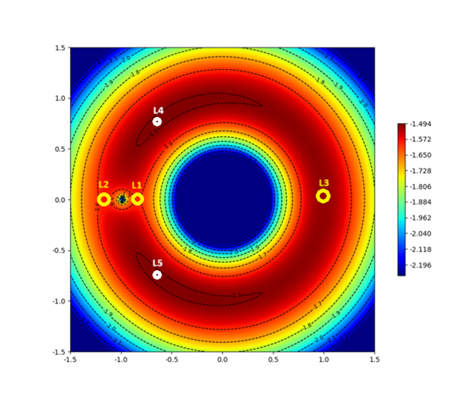
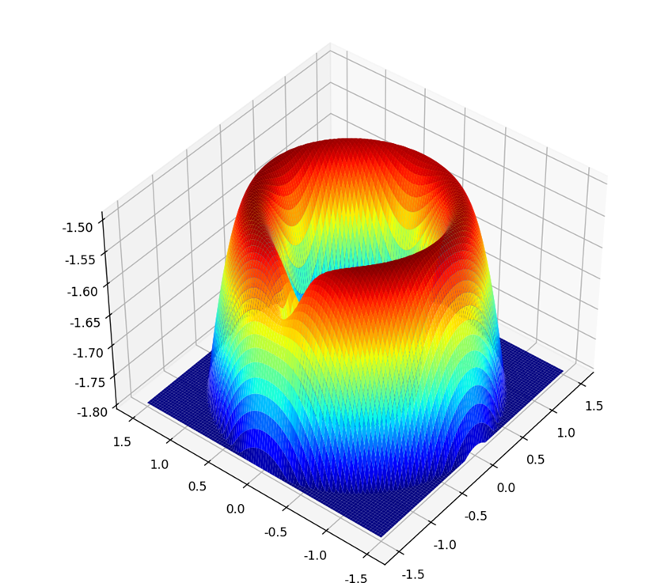
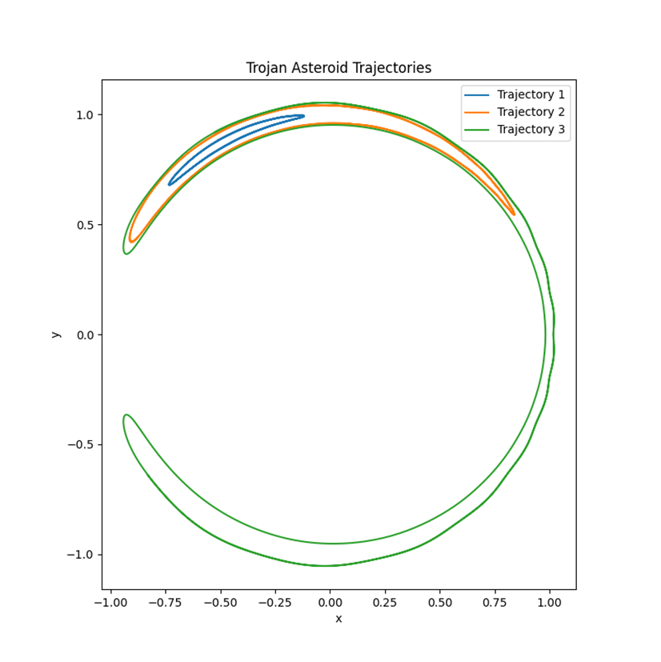
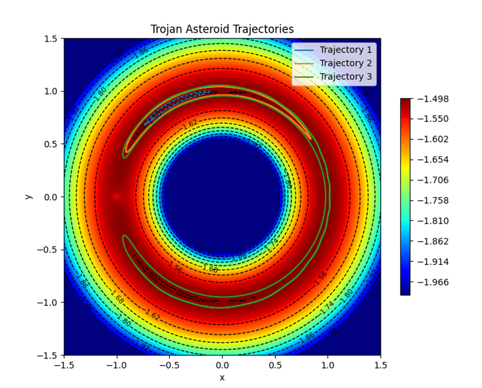

# threeParticle

제한된 3입자계 문제를 시뮬레이션하기 위한 코드입니다.

## 3입자계 문제

3입자계 문제는 세 입자가 3차원 공간에서 서로 중력을 작용하며 운동하는 상황을 다루는 문제입니다. 
2차 미분 방정식 9개를 풀어야 하는 문제로 일반적인 해를 구하기 힘듭니다.
단순화시킨 경우에는 풀이가 가능한데, 이러한 경우를 **제한적 3입자계 문제**라고 합니다.
3개의 입자 중 특별이 무거운 주체 입자 2개와 제 3입자 1개로 이루어졌다고 가정합니다.
주체입자는 질량중심을 중심으로 동일 평면에서 원운동을 한다고 가정합니다.

## 라그랑주점

potential.py

상황에 맞게 알파 값을 변경시키면서 실행시키시면 됩니다.
등고선 그림이나 3D 입체로 나타내실 수 있습니다.

> 주의사항
> 
> 특정 위치에서 퍼텐셜이 지나치게 낮으면 전체 값이 보이지 않습니다.
> 코드에서 potential을 계산하는 부분에서 max함수로 최솟값을 지정한 부분을 수정해가며, 가장 잘 보이는 값을 찾으시면 됩니다.

## 트로이 소행성

간략화된 운동방정식에 초기값을 설정하여 궤도를 그려볼 수 있습니다.

퍼텐셜 그림과 함께 그릴 수 있습니다.